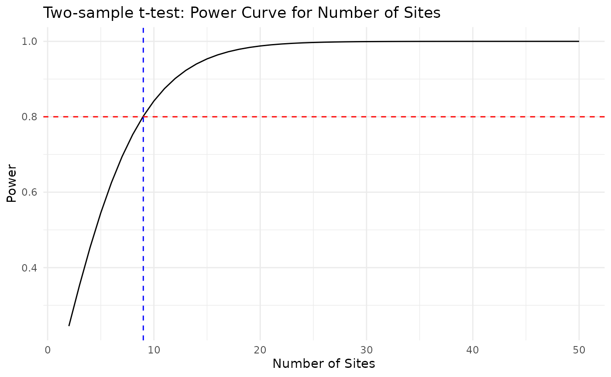
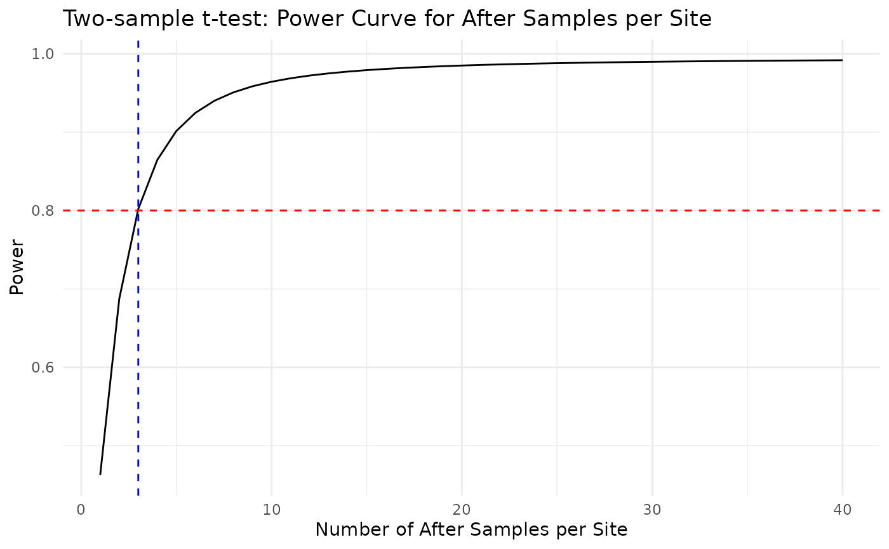
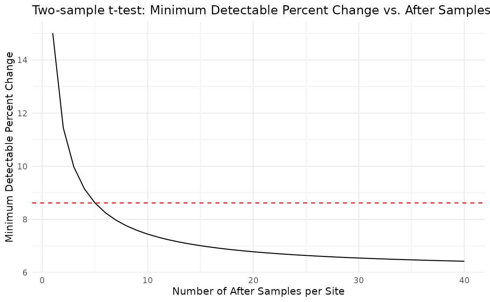
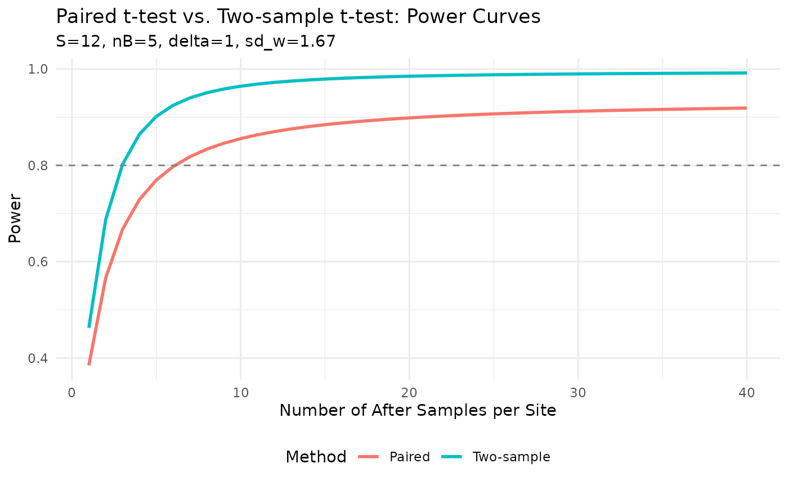

# Two-sample t-test power analysis (ignoring within-site correlation)

## Overview

The functions in this vignette calculate power and sample size for a
**two-sample (unpaired) t-test** that compares all before observations
pooled together against all after observations pooled together, without
accounting for the repeated-measures structure of the data (i.e.,
multiple samples taken at the same site before and after the change).

This contrasts with the paired-t approach in `UserGuide.Rmd`, where each
site’s before-mean is subtracted from its after-mean, effectively
blocking out between-site variability. When there is positive
between-site variation in baseline levels, the paired design is **more
powerful** because it removes that nuisance variability. The two-sample
approach lumps all observations into two groups and ignores the
blocking, which tends to inflate the error term (or, if between-site
variability in changes is large, can sometimes be anti- conservative).
In most ecological before-after designs where sites are truly paired,
the paired approach is preferred. The two-sample approach is appropriate
when before and after samples come from independent groups with no
repeated site structure, or as a check or comparison.

The new functions are:

- [`power_for_n_after_2samp()`](https://ebabcock.github.io/PowerAfterChange/reference/power_for_n_after_2samp.md)
  — simulation-based power for a two-sample t-test
- [`find_min_sites_2samp()`](https://ebabcock.github.io/PowerAfterChange/reference/find_min_sites_2samp.md)
  — analytical minimum sites needed for target power
- [`find_n_after_2samp()`](https://ebabcock.github.io/PowerAfterChange/reference/find_n_after_2samp.md)
  — analytical minimum after samples per site for target power
- [`find_min_detectable_percent_2samp()`](https://ebabcock.github.io/PowerAfterChange/reference/find_min_detectable_percent_2samp.md)
  — analytical minimum detectable percent change

``` r
library(tidyverse)
theme_set(theme_minimal())
library(PowerAfterChange)
```

## Simulated data

We use the **same simulated dataset** as `UserGuide.Rmd` so that results
can be directly compared.

``` r
set.seed(123)
S_demo    <- 12
nB_demo   <- 5
sd_within <- 2
sd_between <- 1
before_mean <- 10
siteMean <- rnorm(S_demo, mean = before_mean, sd = sd_between)
baseline_demo <- data.frame(
  site = rep(1:S_demo, each = nB_demo)) %>%
  mutate(y = rnorm(S_demo * nB_demo, mean = siteMean[site], sd = sd_within))
```

### Estimate within-site SD

``` r
sd_within_hat <- getSD_within(baseline = baseline_demo,
                              siteVar = "site",
                              responseVar = "y")
sd_within_hat
```

    ## [1] 1.671255

### Planning assumptions

``` r
delta_target <- 1    # absolute change to detect
sd_delta     <- 0.5  # site-to-site variability in true changes
```

------------------------------------------------------------------------

## Question 1: Minimum number of sites (nB = 5, nA = 5)

``` r
sites_2samp <- find_min_sites_2samp(
  nB = nB_demo, nA = 5,
  delta = delta_target,
  sd_w  = sd_within_hat,
  target_power = 0.8, alpha = 0.05,
  S_grid = 2:50
)
sites_2samp$S_star
```

    ## [1] 9

``` r
ggplot(sites_2samp$curve, aes(x = S, y = power)) +
  geom_line() +
  geom_hline(yintercept = 0.8, linetype = "dashed", color = "red") +
  geom_vline(xintercept = sites_2samp$S_star, linetype = "dashed", color = "blue") +
  labs(title = "Two-sample t-test: Power Curve for Number of Sites",
       x = "Number of Sites",
       y = "Power")
```



In `UserGuide.Rmd` the paired design required fewer sites when including
between-site change variability (`sd_d`). The two-sample approach
requires 9 sites when `sd_d = 0`, because it ignores the paired
structure and must rely solely on pooled within-site variability.

------------------------------------------------------------------------

## Question 2: Minimum after samples per site (S = 12, nB = 5)

``` r
n_after_2samp <- find_n_after_2samp(
  S  = S_demo, nB = nB_demo,
  delta = delta_target,
  sd_w  = sd_within_hat,
  target_power = 0.8, alpha = 0.05,
  n_grid = 1:40
)
n_after_2samp$n_star
```

    ## [1] 3

``` r
ggplot(n_after_2samp$curve, aes(x = n_after, y = power)) +
  geom_line() +
  geom_hline(yintercept = 0.8, linetype = "dashed", color = "red") +
  geom_vline(xintercept = n_after_2samp$n_star, linetype = "dashed", color = "blue") +
  labs(title = "Two-sample t-test: Power Curve for After Samples per Site",
       x = "Number of After Samples per Site",
       y = "Power")
```



------------------------------------------------------------------------

## Question 3: Minimum detectable percent change (S = 12, nB = 5, nA = 5)

``` r
min_pct_2samp <- find_min_detectable_percent_2samp(
  S = S_demo, nB = nB_demo, nA = 5,
  sd_w = sd_within_hat,
  baseline_mean = before_mean,
  target_power = 0.8, alpha = 0.05
)
min_pct_2samp
```

    ## [1] 8.61903

How does the minimum detectable percent change vary with the number of
after samples?

``` r
nA_grid <- 1:40
detectable_2samp_df <- data.frame(
  n_after = nA_grid,
  min_detectable_percent = sapply(nA_grid, function(nA) {
    find_min_detectable_percent_2samp(
      S = S_demo, nB = nB_demo, nA = nA,
      sd_w = sd_within_hat,
      baseline_mean = before_mean,
      target_power = 0.8, alpha = 0.05
    )
  })
)

ggplot(detectable_2samp_df, aes(x = n_after, y = min_detectable_percent)) +
  geom_line() +
  geom_hline(yintercept = min_pct_2samp, linetype = "dashed", color = "red") +
  labs(
    title = "Two-sample t-test: Minimum Detectable Percent Change vs. After Samples",
    x = "Number of After Samples per Site",
    y = "Minimum Detectable Percent Change"
  )
```



------------------------------------------------------------------------

## Comparing paired t-test vs. two-sample t-test power curves

The plot below overlays the power curve from the **paired t-test**
(`power_for_nA_analytical`) against the **two-sample t-test**
(`find_n_after_2samp`) for the same design parameters. The paired design
accounts for between-site variability in changes (`sd_d`), while the
two-sample design ignores site structure entirely.

``` r
nA_grid <- 1:40

# Paired analytical power (includes sd_delta for between-site change variability)
power_paired <- sapply(nA_grid, function(nA) {
  power_for_nA_analytical(nA, S = S_demo, nB = nB_demo,
                          delta = delta_target,
                          sd_within = sd_within_hat,
                          sd_delta = sd_delta,
                          alpha = 0.05)
})

# Two-sample analytical power (ignores site structure)
power_2samp <- n_after_2samp$curve$power

comparison_df <- data.frame(
  n_after      = nA_grid,
  Paired       = power_paired,
  Two_sample   = power_2samp
) %>%
  pivot_longer(-n_after, names_to = "Method", values_to = "power") %>%
  mutate(Method = recode(Method, Two_sample = "Two-sample"))

ggplot(comparison_df, aes(x = n_after, y = power, color = Method)) +
  geom_line(linewidth = 1) +
  geom_hline(yintercept = 0.8, linetype = "dashed", color = "gray50") +
  labs(
    title = "Paired t-test vs. Two-sample t-test: Power Curves",
    subtitle = paste0("S=", S_demo, ", nB=", nB_demo,
                      ", delta=", delta_target,
                      ", sd_w=", round(sd_within_hat, 2)),
    x = "Number of After Samples per Site",
    y = "Power",
    color = "Method"
  ) +
  theme(legend.position = "bottom")
```



The paired design is more efficient here: it typically reaches target
power with fewer after samples because it eliminates between-site
baseline variability as a source of error.

------------------------------------------------------------------------

## Simulation validation

We validate the analytical `find_n_after_2samp` results by comparing
them to simulation-based estimates from `power_for_n_after_2samp` for a
few values of `nA`.

``` r
nA_check <- c(2, 5, 10, 20)

sim_power <- sapply(nA_check, function(nA) {
  power_for_n_after_2samp(
    S = S_demo, nB = nB_demo, nA = nA,
    delta = delta_target, sd_w = sd_within_hat, sd_d = 0,
    alpha = 0.05, nsim = 2000, seed = 42
  )
})

analytical_power <- sapply(nA_check, function(nA) {
  n_after_2samp$curve$power[n_after_2samp$curve$n_after == nA]
})

validation_df <- data.frame(
  nA              = nA_check,
  Analytical      = round(analytical_power, 3),
  Simulation      = round(sim_power, 3)
)
knitr::kable(validation_df,
             caption = "Two-sample t-test: Analytical vs. Simulation Power")
```

|  nA | Analytical | Simulation |
|----:|-----------:|-----------:|
|   2 |      0.687 |      0.672 |
|   5 |      0.902 |      0.907 |
|  10 |      0.964 |      0.962 |
|  20 |      0.985 |      0.985 |

Two-sample t-test: Analytical vs. Simulation Power

The simulation and analytical results agree closely, confirming that the
analytical formula based on the non-central t distribution is correct.

------------------------------------------------------------------------

## Conclusion

The **paired t-test** (existing functions) is preferred when sites are
genuinely paired and repeated samples are taken at each site, because it
accounts for within-site correlation and is more powerful. The
**two-sample approach** is appropriate when before and after samples
come from independent groups with no repeated site structure, or as a
conservative check or comparison. When there is positive between-site
variation in baselines, the two-sample approach will generally require
more sites or more samples to achieve the same power as the paired
design.
