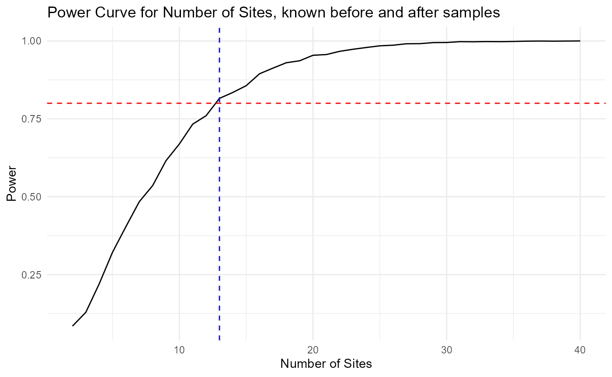
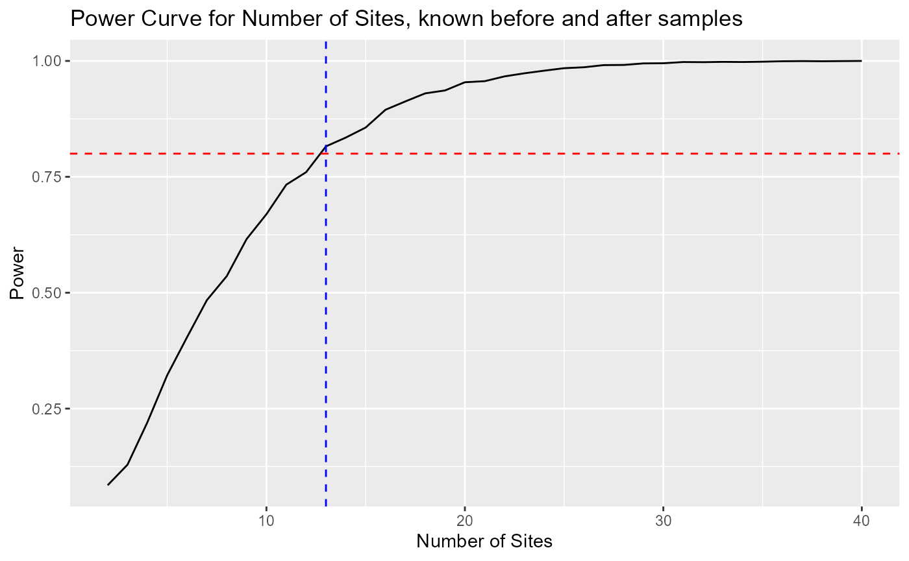

# User guide for power after change

These functions calculate power and sample size for a Before-After
t-test with fixed sites, repeated samples per site. Possible questions
to ask are:

1.  Given a fixed number of sites, samples per site before, and an
    assumed effect size and variances, (a) how many samples per site
    after are needed to achieve target power? or (b) what is the power
    for a given number of samples per site after?

2.  Given a fixed number of samples per site before and after, and an
    assumed effect size and variances, (a) how many sites are needed to
    achieve target power? and (b) what is the power for a given number
    of sites?

Functions are based on Monte Carlo simulation of normal data.

The functions were generated with the help of ChatGPT and GitHub
Copilot, 1/30/2026-2/4/2026.

The following is a simulated data demo.

``` r
library(tidyverse)
#devtools::install_github("ebabcock/PowerAfterChange")
library(PowerAfterChange)
```

## Simulate some data

``` r
set.seed(123)
S_demo <- 12
mB_demo <- 5
sd_within <- 2
sd_between <- 1
before_mean <- 10
#simulate site to site variability
siteMean <- rnorm(S_demo, mean = before_mean, sd = sd_between)
#Genarate baseline data (before change)
baseline_demo <- data.frame(
  site = rep(1:S_demo, each = mB_demo)) %>%
  mutate(y = rnorm(S_demo * mB_demo, mean = siteMean[site], sd = sd_within))
```

#### Estimate within-site SD

We need the within-site standard deviation to plan the study. Here we
estimate it from the baseline data.

``` r
sd_within_hat <-getSD_within(baseline = baseline_demo,
                             siteVar = "site",
                             responseVar = "y")
sd_within_hat
```

    ## [1] 1.671255

#### Planning assumptions

This is the change we want to be able to detect with sufficient power.

``` r
delta_target <- 1
sd_delta <- 0.5
```

#### Find minimum n_after

This function finds the minimum number of samples after the change
needed to achieve target power, given the number of sites and samples
before the change. If we have annual samples, for example, this is the
number of years we would need to sample after the change.

``` r
res_n_after <- find_n_after(S = S_demo, mB = mB_demo,
                    delta = delta_target,
                    sd_w = sd_within_hat, sd_d = sd_delta,
                    target_power = 0.8, alpha = 0.05,
                    n_grid = 1:40, nsim = 3000, seed = 99)
res_n_after$n_star  #Number of after samples need for specified power
```

    ## [1] 6

``` r
head(res_n_after$curve)
```

    ##   n_after     power
    ## 1       1 0.3646667
    ## 2       2 0.5600000
    ## 3       3 0.6833333
    ## 4       4 0.7100000
    ## 5       5 0.7620000
    ## 6       6 0.8070000

``` r
# Plot power curve for number of samples after
ggplot(res_n_after$curve, aes(x = n_after, y = power)) +
  geom_line() +
  geom_hline(yintercept = 0.8, linetype = "dashed", color = "red") +
  geom_vline(xintercept = res_n_after$n_star, linetype = "dashed", color = "blue") +
  labs(title = "Power Curve for Before-After Design",
       x = "Number of After Samples per Site",
       y = "Power") 
```



#### Find minimum sites given before and after number known sample size

In this scenario, we know how many samples we can take before and after
the change, and want to know how many sites are needed to achieve target
power.

``` r
site_res <- find_min_sites(mB = mB_demo, nA = 5,
                           delta = delta_target,
                           sd_w = sd_within_hat, sd_d = sd_delta,
                           target_power = 0.8, alpha = 0.05,
                           S_grid = 2:40, nsim = 3000, seed = 42)

site_res$S_star
```

    ## [1] 13

``` r
# Plot power curve for sites
ggplot(site_res$curve, aes(x = S, y = power)) +
  geom_line() +
  geom_hline(yintercept = 0.8, linetype = "dashed", color = "red") +
  geom_vline(xintercept = site_res$S_star, linetype = "dashed", color = "blue") +
  labs(title = "Power Curve for Number of Sites, known before and after samples",
       x = "Number of Sites",
       y = "Power")
```


